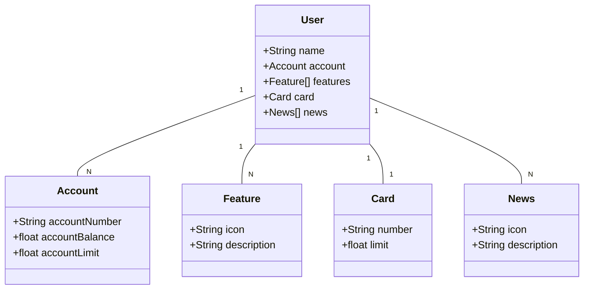

# Santander Dev Week 2024
Java API RESTful criada para o bootcamp do Santander, feito por FLCordis.

## Diagrama de Classes

```mermaid
classDiagram
    class User {
        +String name
        +Account account
        +Feature[] features
        +Card card
        +News[] news
    }

    class Account {
        +String accountNumber
        +float accountBalance
        +float accountLimit
    }

    class Feature {
        +String icon
        +String description
    }

    class Card {
        +String number
        +float limit
    }

    class News {
        +String icon
        +String description
    }

    User "1" -- "N" Account
    User "1" -- "N" Feature
    User "1" -- "1" Card
    User "1" -- "N" News
```
